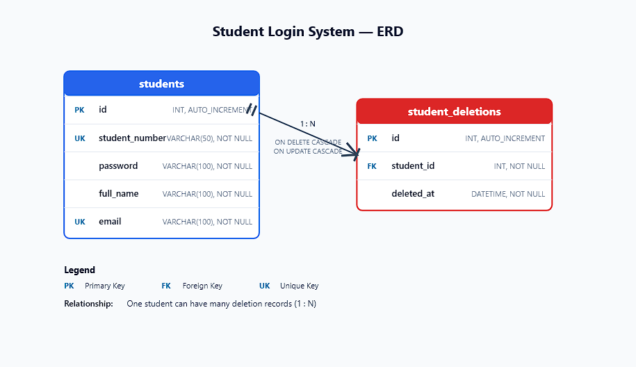

# Student Login System – Short Report

## 1. Entity-Relationship Diagram (ERD)



The ERD shows two main parts of the system:
- `students`: stores each student’s account details, including `student_number`, `password`, `full_name`, and `email`.
- `student_deletions`: records deleted students by saving their `student_number` and the time of deletion.

When a student is deleted from `students`, the trigger automatically adds a log entry to `student_deletions`.

---

## 2. Database Schema

**Table: students**
- `id` INT, PRIMARY KEY, AUTO_INCREMENT
- `student_number` VARCHAR(50), UNIQUE, NOT NULL
- `password` VARCHAR(100), NOT NULL
- `full_name` VARCHAR(100), NOT NULL
- `email` VARCHAR(100), UNIQUE, NOT NULL

**Table: student_deletions**
- `id` INT, PRIMARY KEY, AUTO_INCREMENT
- `student_number` VARCHAR(50), NOT NULL
- `deleted_at` DATETIME, NOT NULL

---

## 3. SQL Queries

**Table Creation:**
```sql
CREATE TABLE students (
    id INT NOT NULL AUTO_INCREMENT PRIMARY KEY,
    student_number VARCHAR(50) NOT NULL UNIQUE,
    password VARCHAR(100) NOT NULL,
    full_name VARCHAR(100) NOT NULL,
    email VARCHAR(100) NOT NULL UNIQUE
);

CREATE TABLE student_deletions (
    id INT NOT NULL AUTO_INCREMENT PRIMARY KEY,
    student_number VARCHAR(50) NOT NULL,
    deleted_at DATETIME NOT NULL
);
```
- **Create:**  
  ```sql
  INSERT INTO students (student_number, password, full_name, email)
  VALUES ('SN-003', 'newpass', 'New User', 'newuser@example.com');
  ```
- **Read:**  
  ```sql
  SELECT * FROM students;
  SELECT * FROM students WHERE student_number = 'SN-001';
  ```
- **Update:**  
  ```sql
  UPDATE students SET password = 'newpassword' WHERE student_number = 'SN-001';
  ```
- **Delete:**  
  ```sql
  DELETE FROM students WHERE student_number = 'SN0-002';
  ```

**Stored Procedure:**
```sql
DELIMITER //
CREATE PROCEDURE GetStudentByNumber(IN snum VARCHAR(50))
BEGIN
    SELECT * FROM students WHERE student_number = snum;
END //
DELIMITER ;
```

**Trigger:**
```sql
DELIMITER //
CREATE TRIGGER after_student_delete
AFTER DELETE ON students
FOR EACH ROW
BEGIN
  INSERT INTO student_deletions (student_number, deleted_at)
  VALUES (OLD.student_number, NOW());
END //
DELIMITER ;
```

---

## 4. Application Demonstration

- The application supports adding, updating, viewing, and deleting students.
- Both student number and email are unique.
- The UI is modern and responsive.
- All database constraints and triggers are enforced.

---

## 5. Technologies Used

- **Frontend:** HTML, CSS, JavaScript (Vanilla JS)
- **Backend:** Node.js with Express.js
- **Database:** MySQL
- **Tools:** MySQL Workbench (for database management), Figma (for ERD design)
- **Other:** Modern CSS for responsive and clean UI
